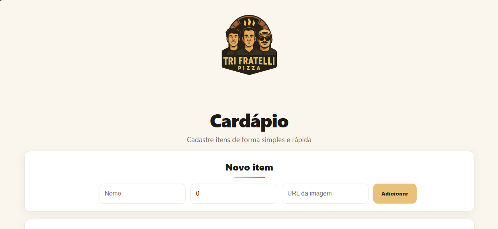
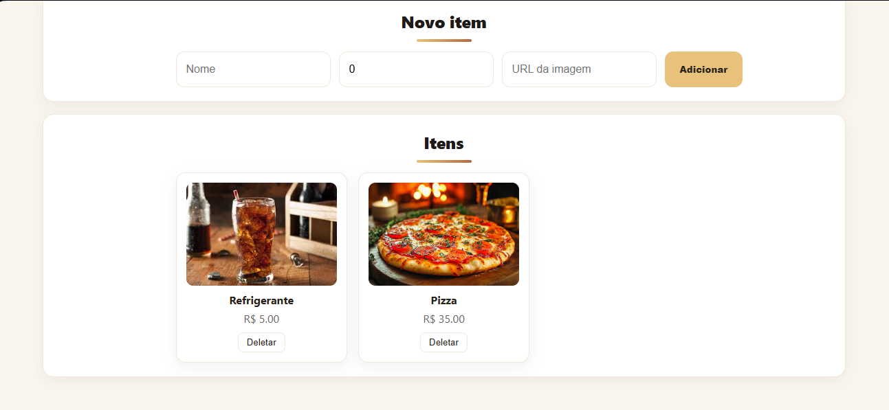

# 🍕 TRI FRATELLI - CARDÁPIO DIGITAL

## 🎯 OBJETIVO  
Desenvolver um sistema completo de cardápio digital para a pizzaria *Tri Fratelli*, proporcionando uma experiência moderna e eficiente para gerenciamento e visualização de produtos.

---
## 🎨 Layout

A interface apresenta um design simples e elegante, com cores e estilos inspirados na identidade visual da pizzaria Tri Fratelli.




---

## 🧩 TECNOLOGIAS UTILIZADAS

### 💻 Back-end


- Node.js – Ambiente de execução JavaScript server-side  
- Express.js – Framework web para criação da API RESTful  
- TypeScript – Superset JavaScript com tipagem estática  
- Prisma ORM – Ferramenta de mapeamento objeto-relacional  
- SQLite – Banco de dados relacional utilizado no desenvolvimento  


### 🖥️ Front-end


- React – Biblioteca para construção de interfaces interativas  
- TypeScript – Tipagem estática e maior segurança no código  
- Vite – Ferramenta de build e desenvolvimento otimizada  
- Axios – Cliente HTTP para integração com a API  
- CSS3 – Estilização moderna e responsiva  


### 🗄️ Banco de Dados


- SQLite – Banco de dados relacional embutido  
- Prisma ORM – Interface para operações e modelagem do banco  


### 🔐 Criptografia
- dotenv – Gerenciamento de variáveis de ambiente e credenciais  


### 🐳 Containerização

- Docker – Containerização da aplicação para ambiente isolado  
- Dockerfile – Configuração de ambiente e dependências  


### 🤖 Inteligência Artificial
- Planejada para futuras versões (recomendações automáticas de pizzas)

---

## 🧱 ARQUITETURA DA APLICAÇÃO

### 🧩 Backend Architecture
```
backend/
├── prisma/           # Schema e migrações do banco
├── src/
│   ├── controllers/   # Lógica das rotas
│   ├── routes/        # Definição de endpoints
│   ├── services/      # Regras de negócio
│   └── api/           # Configurações da API
```

### 💻 Frontend Architecture
```
frontend/
├── src/
│   ├── components/   # Componentes reutilizáveis
│   ├── api/          # Cliente HTTP
│   ├── types/        # Definições TypeScript
│   └── styles/       # Estilos CSS
```

---

## 👥 CONTRIBUIÇÕES POR MEMBRO

### 👨‍💻 João Pedro Guinati
- Refatoração completa do backend de Java para Node.js/TypeScript  
- Estruturação e otimização do projeto backend  
- Implementação do Express.js com TypeScript  
- Configuração do Prisma ORM com SQLite  
- Containerização com Docker  
- Ajustes visuais e de integração no frontend  

### 👨‍💻 Mateus dos Santos Moreira
- Desenvolvimento inicial do backend em Java  
- Contribuição acadêmica na estrutura base do projeto  
- Documentação dos requisitos e funcionalidades  

### 👨‍💻 Igor Takagui Reis
- Desenvolvimento completo do frontend em React/TypeScript  
- Design e implementação da interface do usuário  
- Integração com a API do backend  
- Componentização e estrutura modular  
- Estilização responsiva com CSS  

---

## ⚙️ FUNCIONALIDADES

### 🧩 Backend API
✅ CRUD Completo – Create, Read, Update, Delete de alimentos  
✅ Endpoints RESTful – API padronizada seguindo boas práticas  
✅ Validação de Dados – Tipagem e checagem via TypeScript  
✅ Persistência – Armazenamento em SQLite com Prisma  
✅ Containerização – Deploy consistente com Docker  

### 💻 Frontend Interface
✅ Listagem Dinâmica – Exibição em tempo real dos produtos  
✅ Formulário de Cadastro – Interface intuitiva e validada  
✅ Exclusão Instantânea – Remoção imediata dos itens  
✅ Design Responsivo – Interface adaptável para todos os dispositivos  

---

## 🚀 INSTALAÇÃO E EXECUÇÃO

### 📦 Pré-requisitos
- Node.js 18+  
- npm ou yarn  
- Docker (opcional)

### 🔧 Backend
```bash
cd backend
npm install
cp .env.example .env
npx prisma migrate dev
npm run dev
```

### 💻 Frontend
```bash
cd frontend
npm install
cp .env.example .env
npm start
```

A aplicação estará disponível em:  `http://localhost:3000`

---

## 🌐 ENDPOINTS DA API
````
| Método | Rota             | Descrição                |
|--------|------------------|--------------------------|
| GET    |   /api/foods     | Lista todos os alimentos |
| POST   |   /api/foods     | Cria um novo alimento    |
| DELETE |   /api/foods/:id | Remove alimento por ID   |
````
---

## 📄 LICENÇA
Projeto acadêmico desenvolvido para a disciplina de **Desenvolvimento Web II – UNIFACEF**.  
Livre para uso educacional e estudos.

---

## 👨‍🏫 DESENVOLVIDO POR:
João Pedro Guinati, Mateus dos Santos Moreira e Igor Takagui Reis

📍 *UNIFACEF – Engenharia de Software*  

📚 *Disciplina: Desenvolvimento Web II*
