# 🍕 TRI FRATELLI - CARDÁPIO DIGITAL


## OBJETIVO  
Desenvolver um sistema completo de cardápio digital para a pizzaria Tri Fratelli, com frontend moderno, backend escalável, banco em nuvem, autenticação segura, containerização e integração com IA para recomendações de pizzas.

Link do projeto: https://cardapio-digital-qnfh.vercel.app/

---

## LAYOUT
A interface apresenta um design simples e elegante, com cores e estilos inspirados na identidade visual da pizzaria Tri Fratelli.

### Vídeo do projeto:
https://github.com/user-attachments/assets/3ea8df99-6507-4632-ba43-330a0a390377

### Imagens do projeto:
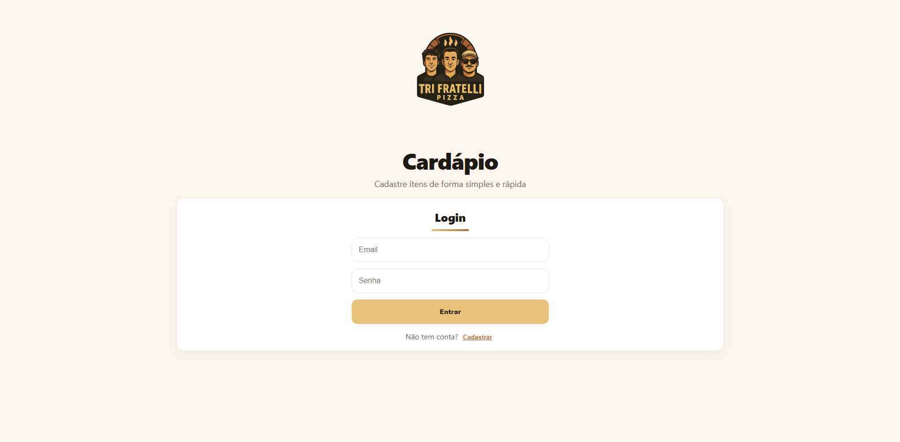
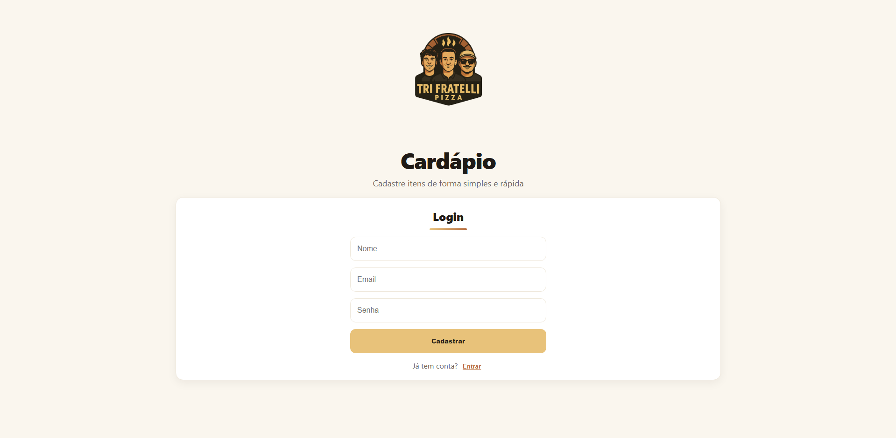
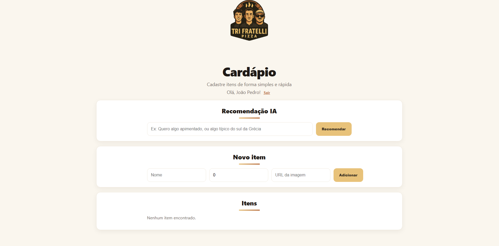
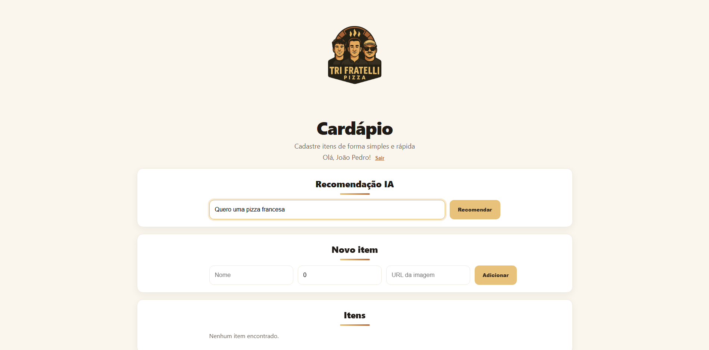
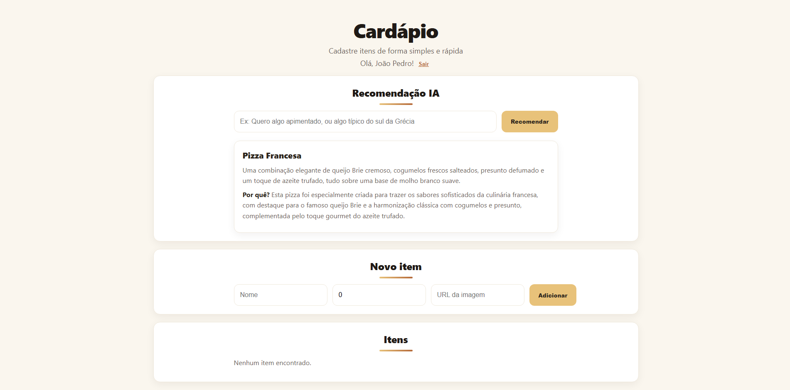
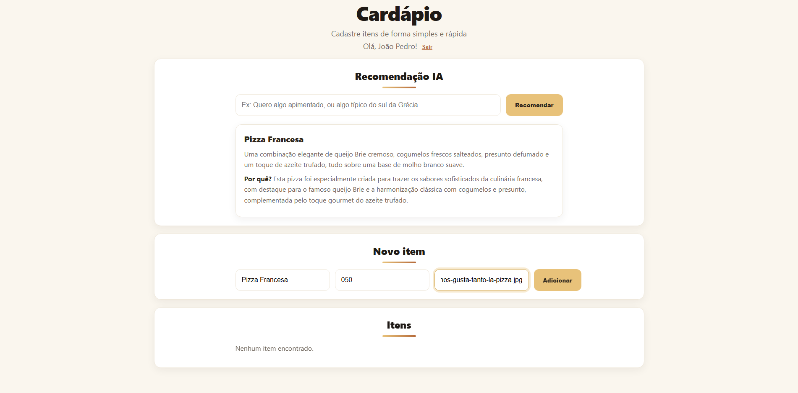
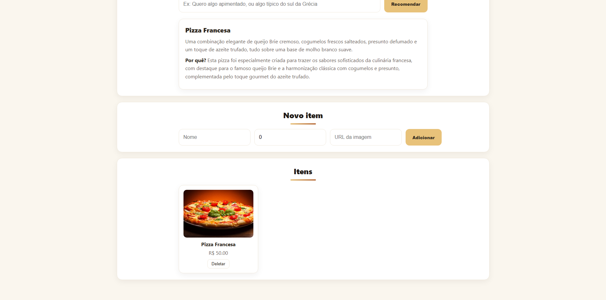
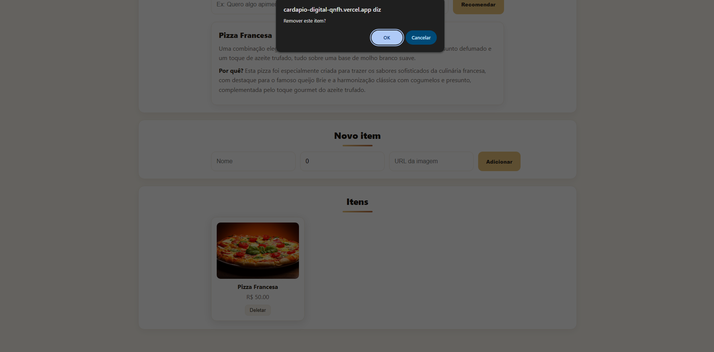

---

## TECNOLOGIAS UTILIZADAS
### Back-end


- Node.js + Express — API REST completa
- TypeScript — Tipagem segura
- Prisma ORM — Mapeamento de dados
- Supabase (PostgreSQL) — Banco SQL principal
- bcrypt — Criptografia de senhas
- JWT — Autenticação e proteção de rotas
- Docker & Docker Compose — Containerização da aplicação
- API Gemini — IA generativa para análise e recomendações

### Front-end


- React – Biblioteca para construção de interfaces interativas  
- TypeScript – Tipagem estática e maior segurança no código  
- Vite – Ferramenta de build e desenvolvimento otimizada  
- Axios – Cliente HTTP para integração com a API  
- CSS3 – Estilização moderna e responsiva  

### Banco de Dados


- Supabase (PostgreSQL) — Banco de produção em nuvem
- Prisma ORM — Controle de schema e queries

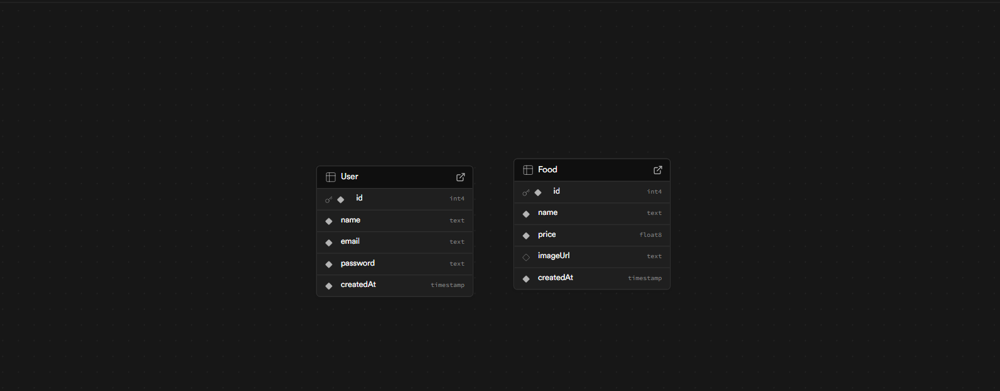

### Criptografia
- Registro e login com criptografia bcrypt
- Tokens JWT para acesso protegido
- Middlewares de segurança
- Variáveis sensíveis via .env

### Containerização

- Docker – Containerização da aplicação para ambiente isolado  
- Dockerfile – Configuração de ambiente e dependências  

### Inteligência Artificial (Gemini 2.5 Flash)
O sistema utiliza IA para:
- Recomendações inteligentes com base no desejado, como por exmeplo se deseja uma pizza de portugal, pizza apimentada

---

## ARQUITETURA DA APLICAÇÃO
### Arquitetura Backend
```
backend/
├── prisma/               # Schema e migrações
├── src/
│   ├── controllers/      # Lógica dos endpoints
│   ├── models/           # Regras de negócio
│   ├── routes/           # Rotas
│   ├── middleware/       # Segurança, validações, auth
│   ├── prismaClient.ts   # Instância do Prisma
│   └── index.ts          # Inicialização do servidor
```
### Arquitetura Frontend
```
frontend/
├── src/
│   ├── components/       # Componentes de UI
│   ├── api/              # Comunicação via Axios
│   ├── assets/           # Imagens, ícones
│   ├── types/            # Tipagens
│   ├── App.tsx
│   ├── App.css
│   ├── index.tsx
│   └── index.css
```
---
## FUNCIONALIDADES
### Backend API
- CRUD completo para gerenciamento dos alimentos
- API RESTful seguindo padrões profissionais de arquitetura
- Validação de dados forte com TypeScript
- Integração com Supabase (PostgreSQL) para persistência confiável em nuvem
- Criptografia de senhas com bcrypt garantindo segurança no armazenamento
- Autenticação JWT com geração e verificação de tokens
- Proteção de rotas privadas via middleware de autorização
- Containerização com Docker, permitindo ambiente padronizado e fácil deploy
### Frontend Interface
- Listagem dinâmica dos produtos com atualização instantânea
- Formulário de cadastro intuitivo com validação e UX amigável
- Exclusão imediata de itens com reatividade visual
- Fluxo completo de autenticação (login, persistência e logout)
- Acesso restrito a áreas protegidas, consumindo endpoints seguros
- Design totalmente responsivo, adaptado para todos os dispositivos
---
## BANCO DE DADOS
### Tabela de usuários:
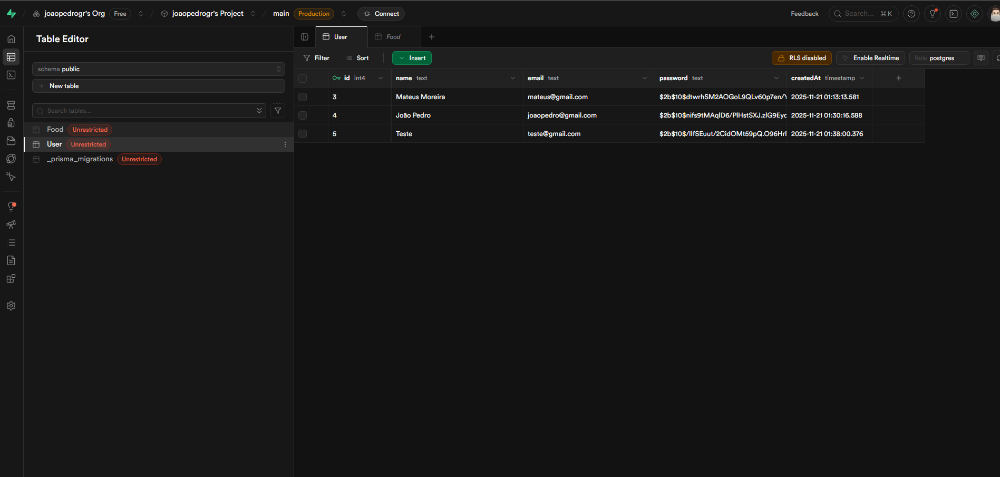
### Tabela de alimentos:
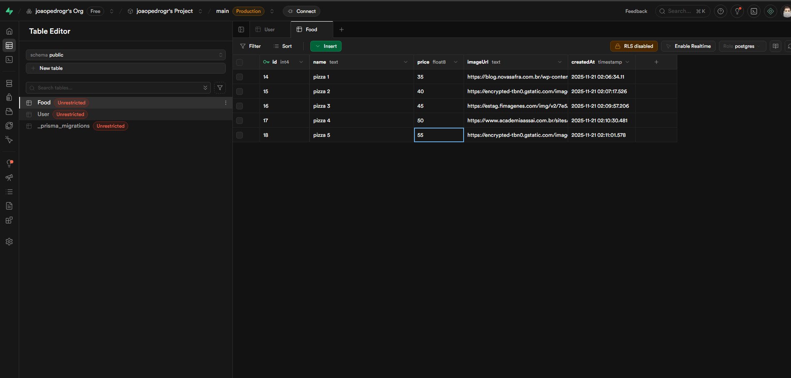
---

## ENDPOINTS DA API

Link do backend: https://cardapio-digital-tmu7.onrender.com/

### Autenticação
```
| Método | Rota              | Descrição                             |
|--------|-------------------|---------------------------------------|
| POST   | /api/auth/register | Registra um novo usuário             |
| POST   | /api/auth/login    | Realiza login e retorna JWT          |
| GET    | /api/auth/me       | Retorna dados do usuário autenticado |
```
### Alimentos
```
| Método | Rota               | Descrição                     |
|--------|--------------------|-------------------------------|
| GET    | /api/foods         | Lista todos os alimentos      |
| POST   | /api/foods         | Cria um novo alimento         |
| PUT    | /api/foods/:id     | Atualiza um alimento          |
| DELETE | /api/foods/:id     | Remove alimento por ID        |
```
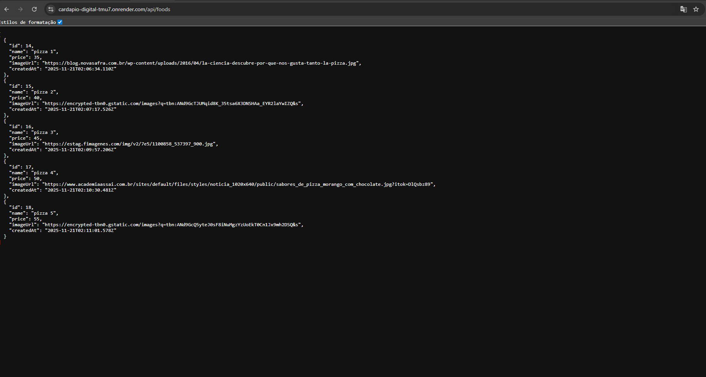
### Inteligência Artificial
```
| Método | Rota                | Descrição                                    |
|--------|---------------------|----------------------------------------------|
| POST   | /api/ai/recommend   | Retorna recomendação de pizza via IA Gemini  |
```
### Fluxo de Autenticação
- Cadastro com senha → bcrypt
- Login gera JWT
- Token armazenado no frontend
- Rotas privadas exigem:
```
Authorization: Bearer <token>
```
---
## DIAGRAMA DE ARQUITETURA
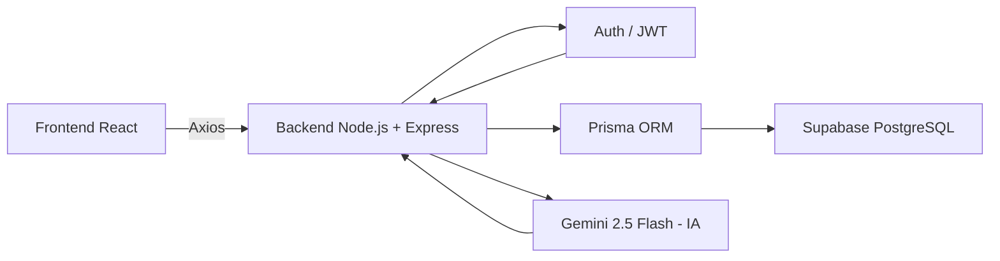
---
## INSTALAÇÃO E EXECUÇÃO
### Pré-requisitos
- Node.js 18+  
- npm ou yarn  
- Docker (opcional)
### Backend
```bash
cd backend
npm install
cp .env.example .env
```
Preencher:
```
DATABASE_URL="postgresql://..."
SUPABASE_URL="..."
SUPABASE_KEY="..."
GEMINI_API_KEY="..."
JWT_SECRET="..."
```
```
npx prisma migrate dev
npm run dev
```
### Frontend
```
cd frontend
npm install
cp .env.example .env
npm start
```
A aplicação estará disponível em:  http://localhost:3000
---
## CONTRIBUIÇÕES POR MEMBRO
### João Pedro Guinati
- Refatoração completa do backend de Java para Node.js/TypeScript  
- Estruturação e otimização do projeto backend  
- API REST
- Supabase/PostgreSQL
- Autenticação (bcrypt + JWT)
- Integração com IA (Gemini 2.5 Flash)
- Containerização com Docker  
- Ajustes visuais e de integração no frontend  
### Mateus dos Santos Moreira
- Desenvolvimento inicial do backend em Java  
- Contribuição acadêmica na estrutura base do projeto  
- Documentação dos requisitos e funcionalidades  
### Igor Takagui Reis
- Desenvolvimento completo do frontend em React/TypeScript  
- Design e implementação da interface do usuário  
- Integração com a API do backend  
- Componentização e estrutura modular  
- Estilização responsiva com CSS  
---
## LICENÇA
Projeto acadêmico desenvolvido para a disciplina de *Desenvolvimento Web II – UNIFACEF*.  
Livre para uso educacional e estudos.
---
## DESENVOLVIDO POR:
João Pedro Guinati, Mateus dos Santos Moreira e Igor Takagui Reis
 *UNIFACEF – Engenharia de Software*
 *Disciplina: Desenvolvimento Web II*
