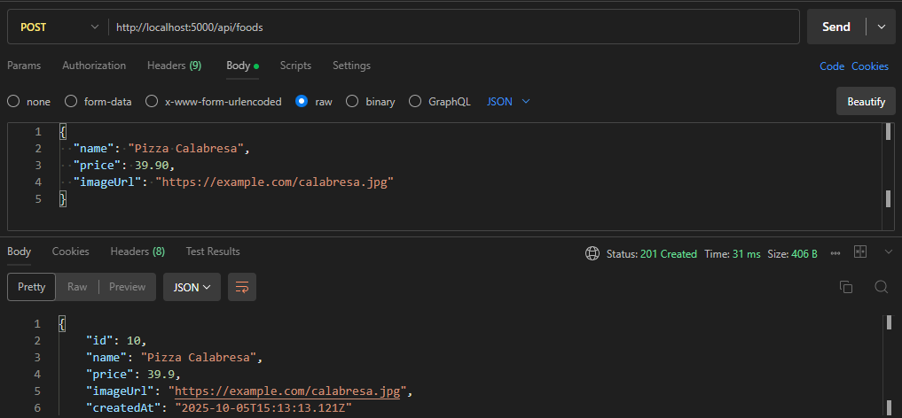
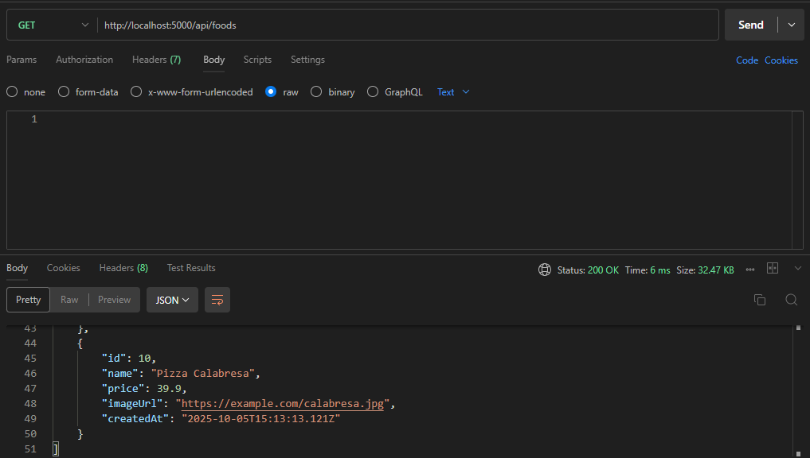
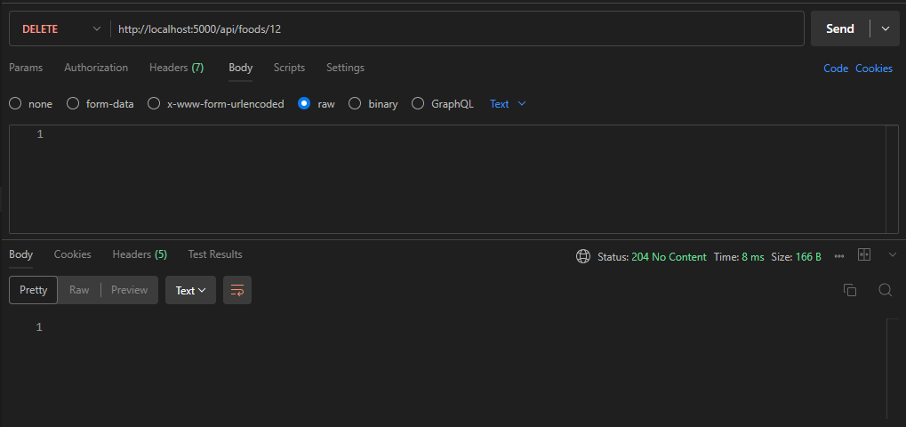

# 🍕 Tri Fratelli Backend 
[](https://skillicons.dev) 

--- 

## 🍽️ Sobre o Projeto 

O backend é o coração do cardápio digital da pizzaria Tri Fratelli, responsável por gerenciar os dados de alimentos, preços e imagens, fornecendo uma API RESTful para integração com o front-end. 

Este backend foi originalmente desenvolvido em Java pelo Mateus, mas devido a problemas de compilação e portabilidade, o sistema foi totalmente refatorado em Node.js com TypeScript, utilizando Express e Prisma ORM para facilitar o desenvolvimento e manutenção.

Toda a refatoração, estruturação e otimização do projeto foram realizadas por João Pedro. 

--- 

## ⚙️ Tecnologias Utilizadas 

- Node.js 
- Express.js 
- TypeScript 
- Prisma ORM 
- SQLite 
- Docker 
- dotenv 

--- 

## 🧩 Estrutura do Projeto
```
backend/
├── prisma/
│ ├── schema.prisma
│ └── dev.db
├── src/
│ ├── api/
│ │ └── foodApi.ts
│ ├── routes/
│ │ └── foodRoutes.ts
│ ├── controllers/
│ │ └── foodController.ts
│ ├── services/
│ │ └── foodService.ts
│ ├── index.ts
│ └── server.ts
├── .env
├── Dockerfile
├── package.json
├── tsconfig.json
└── readmeBackend.md
```

--- 

## 🚀 Como Rodar o Projeto 
### 🧱 Pré-requisitos 
- Node.js (versão 18 ou superior) 
- npm ou yarn 
- Docker (opcional) 

### 🖥️ Clonando o repositório
```
git clone https://github.com/joaopedrogr/Cardapio-Digital.git
cd backend
npm install
```

### ⚙️ Configurando o ambiente Crie um arquivo .env na raiz do projeto com o seguinte conteúdo:
```
DATABASE_URL="file:./prisma/dev.db"
PORT=5000
```

### 🔧 Rodando o projeto localmente
```
npm run dev
```
O servidor estará disponível em: `http://localhost:5000` 

### 🐳 Rodando com Docker
```
docker build -t backend .
docker run -p 5000:5000 backend
```

---

## 📡 Endpoints Principais
```
| Método | Rota          | Descrição                              |
|--------|---------------|----------------------------------------|
| GET    | /api/foods    | Retorna todos os alimentos cadastrados |
| POST   | /api/foods    | Cadastra um novo alimento              |
| DELETE | /api/foods/:id| Remove um alimento pelo ID             |
```
### 🧾 Exemplos de Requisição 

#### ➕ POST /api/foods 
Requisição:
```
{
  "name": "Pizza Calabresa",
  "price": 39.90,
  "imageUrl": "https://example.com/calabresa.jpg"
}
```

Resposta:
```
{
  "id": 9,
  "name": "Pizza Calabresa",
  "price": 39.9,
  "imageUrl": "https://example.com/calabresa.jpg",
  "createdAt": "2025-10-05T02:00:00.000Z"
}
```

#### 📋 GET /api/foods Resposta:
```
  {
    "id": 9,
    "name": "Pizza Calabresa",
    "price": 39.9,
    "imageUrl": "https://example.com/calabresa.jpg",
    "createdAt": "2025-10-05T02:00:00.000Z"
  }
```
#### ❌ DELETE /api/foods/:id 
Exemplo de requisição:
```
DELETE http://localhost:5000/api/foods/12
```
Resposta:
204 No Content → não permite corpo na resposta (por isso sua mensagem poderia ser ignorada), mas informa que a ação foi concluída com sucesso.

---

## 🧪 Testando no Postman Abaixo está um exemplo de teste realizado no Postman, mostrando a API em funcionamento: 

### ➕ POST /api/foods 
 

### 📋 GET /api/foods 
 

### ❌ DELETE /api/foods/:id 
 

---

## 📄 Licença 

Este projeto pode servir como base para estudos e expansão de soluções de cardápio digital. Fique à vontade para contribuir ou adaptar conforme necessário.
